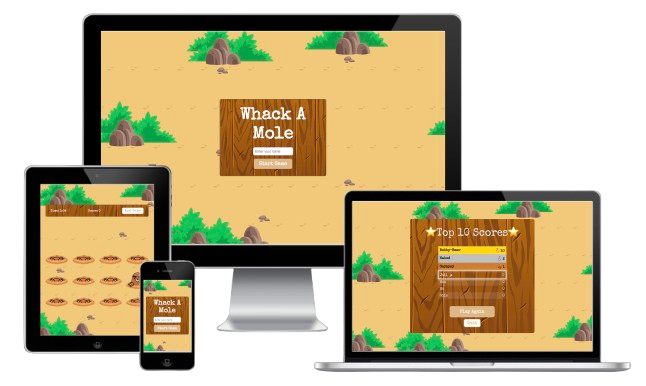

# Getting Started with Whack-A-Mole🚀

This project is a fun take on the classic Whack-A-Mole game, built with modern tools and technologies to enhance the development experience and performance.

## Screenshots

<div style="display: flex">
    
</div>

## 🧐 What's inside?

- ⚛️ [React](https://reactjs.org/) - A JavaScript library for building user interfaces.
- ⚡️ [Redux Toolkit](https://redux-toolkit.js.org/) - A set of tools to simplify Redux development.
- ✨ [TypeScript](https://www.typescriptlang.org/) - A typed superset of JavaScript that scales.
- 🎉 [Sass](https://sass-lang.com/) - A professional CSS extension language.
- 💾 LocalStorage - Used for persisting game state (like player scores and session data)
- 🔄 [Supabase](https://supabase.com/) - Integrated for storing and fetching leaderboard data
- 🔒 Login (No Registration) - Allows players to log in without registering
- 🎯 Score Modal - A detailed score summary modal that appears at the end of each game, showing the player's final score and personal best.

## 📏📏Pending (TODO)📏📏

- Add Sound Effects

## 🦋 Deployment

- [Render](https://render.com/)

## 🚀 Getting Started

Run the following command to create a new project with this Starter:

```
yarn create next-app my-app -e https://github.com/pgm-thabisadingani/whack-a-mole
# or
npx create-next-app my-app -e https://github.com/pgm-thabisadingani/whack-a-mole
```

Once the project and dependencies are finished installing, you can navigate to that directory and start up the development server with:

```
yarn start
# or
npm run start
```
